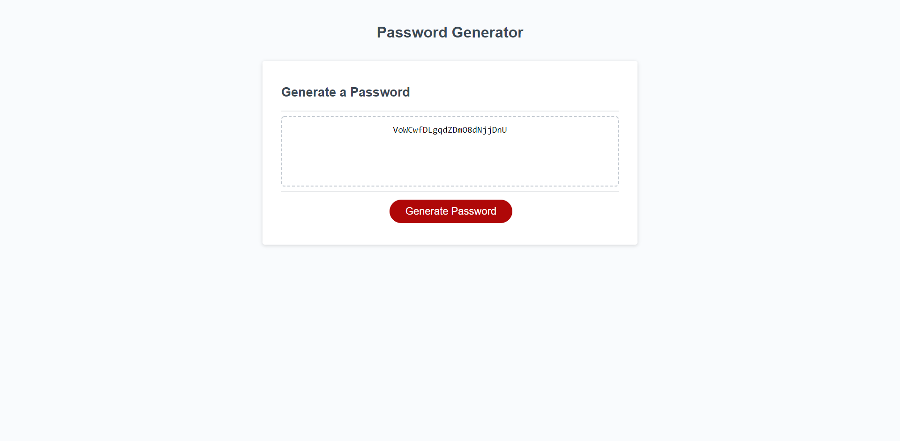

# Password Generator Starter Code
 ## Summary
 This is a password generator that takes input from the user to make a custom password based on number of charectors between 8 and 128 and what types of characters the user wants in the password
 
 ## Technologies
 * HTML - 12.0%
 * css - 25.8%
 * JavaScript - 62.2% 
 
 ## Code Breakdown
 the code starts off by asking the user with a "window.prompt" what length they wanted the code (if the user doesn't input a value between 8 and 128 they'll be kept in a while loop until they do) and then proceeds to show the user confirmation window where they can choose wether to use uppercase, lowercase, numbers, and special character. after the user chooses what characters they want in they're password a series of "if" and "else if" triggers that have functions nested inside of them that runs math to determine which characters from the string get chosen and a return statement sends the character back to the "randomChar()" function. And then an "else" statement with a "for" loop keeps adding the "randomChar" values into the "randomPassword" variable until it reaches the number of characters that the user inputted into the "window.prompt". once the password is created its sent into the "writePassword()" function where its inserted into the "passwordText.value" and shown to the user.

 ## Active Page
https://khyan22.github.io/password-generator/

## Page ScreenShot
